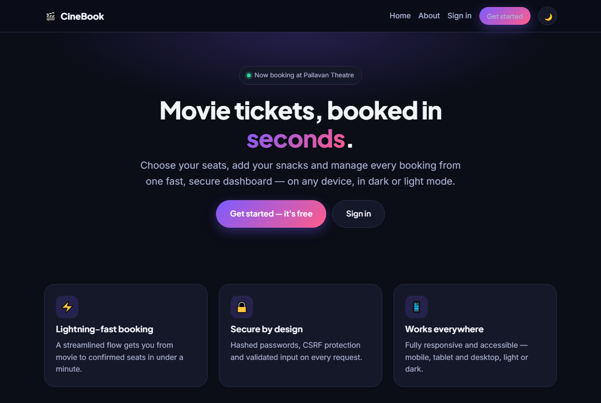
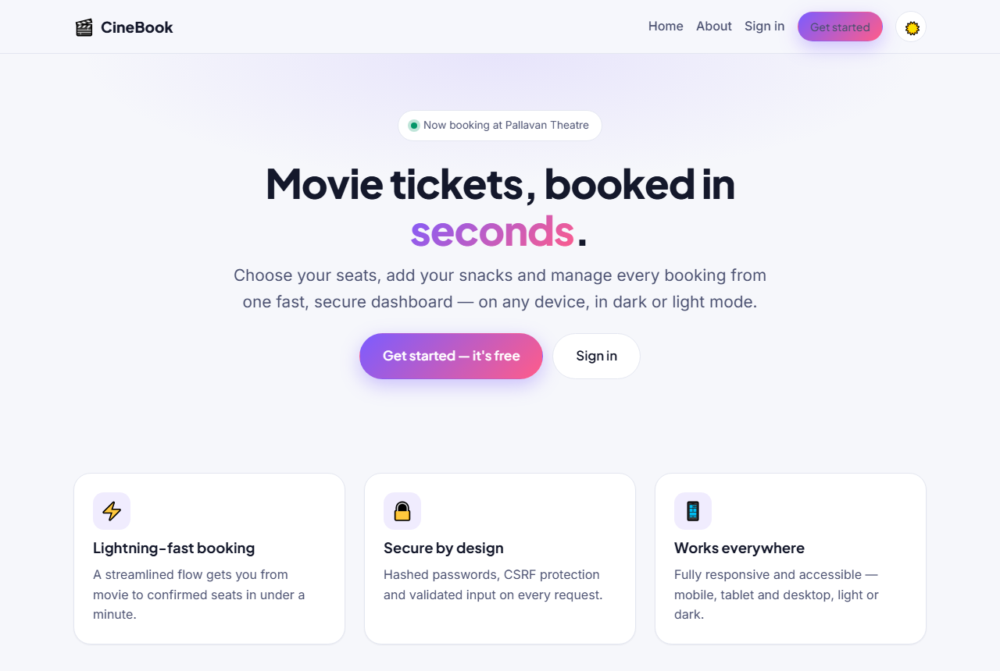
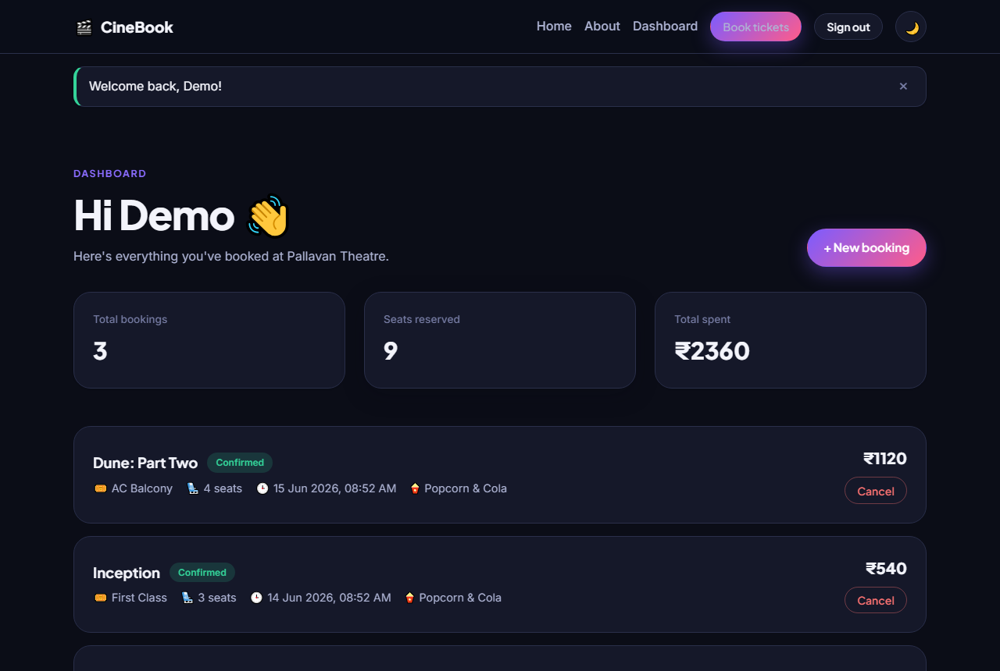
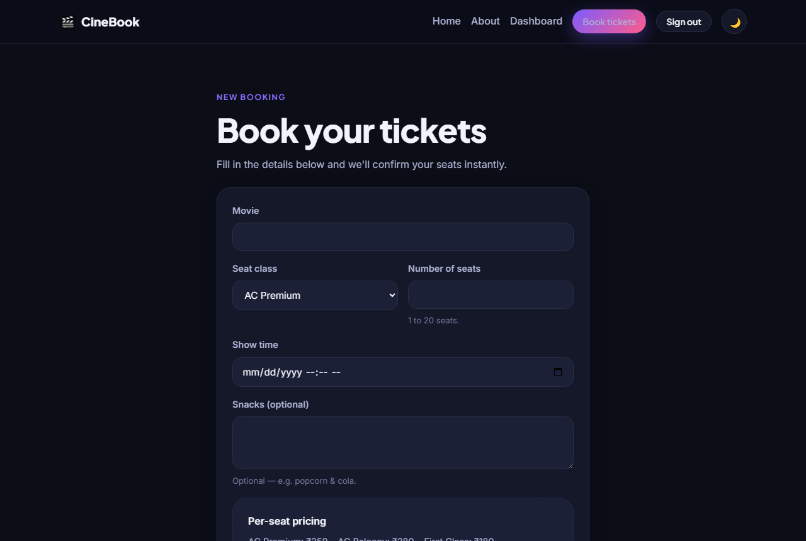
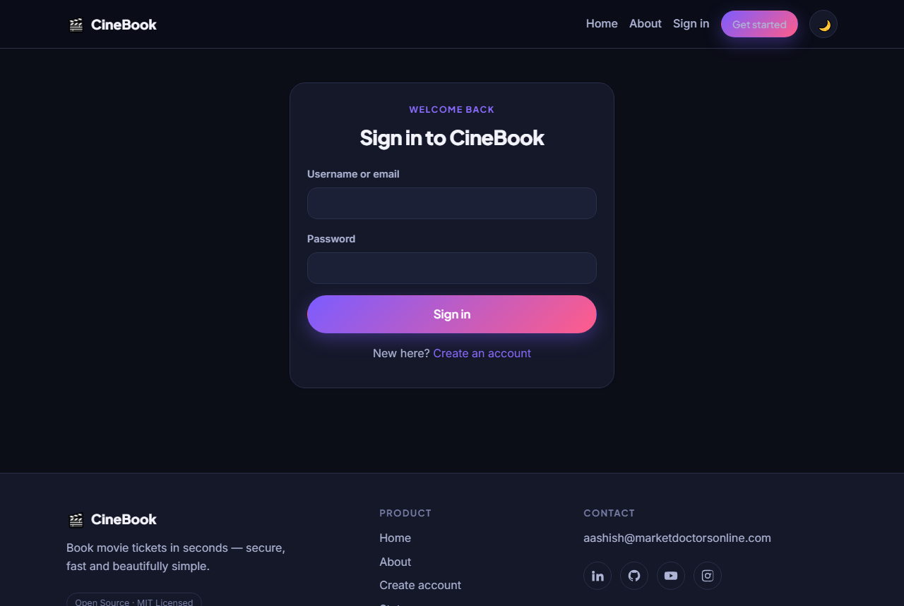
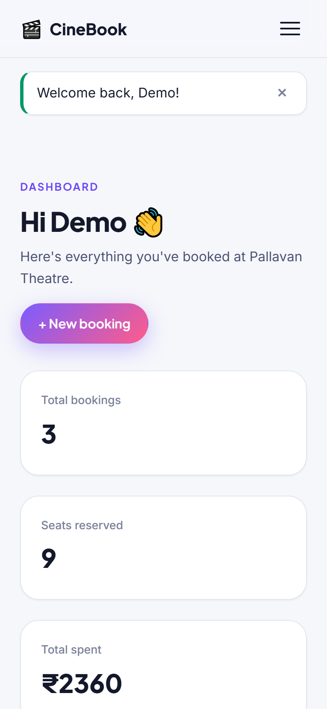

<div align="center">

# 🎬 CineBook — Movie Ticket Booking

**A secure, production-ready movie ticket booking web app built with Flask.**

Sign up, choose a seat class, add your snacks, and manage every booking from a
fast, beautiful dashboard — in dark or light mode, on any device.

[](https://github.com/aashishbharti04/movie-ticket-booking/actions/workflows/ci.yml)
[](LICENSE)
[](https://www.python.org/)
[](https://flask.palletsprojects.com/)
[](https://github.com/astral-sh/ruff)

</div>

---

## 📑 Table of Contents

- [Overview](#-overview)
- [Features](#-features)
- [Screenshots](#-screenshots)
- [Tech Stack](#-tech-stack)
- [Installation](#-installation)
- [Usage](#-usage)
- [Configuration](#-configuration)
- [Deployment](#-deployment)
- [Project Structure](#-project-structure)
- [Testing](#-testing)
- [Documentation](#-documentation)
- [Contributing](#-contributing)
- [FAQ](#-faq)
- [License](#-license)
- [Contact](#-contact)

---

## 🎯 Overview

CineBook started life as a small command-line script for booking tickets at
*Pallavan Theatre*. It has been **rebuilt from the ground up** into a modern,
secure web application — while preserving the original concept: customers can
**sign up, log in, pick a seat class (AC / Non‑AC / 1st / 2nd class equivalents),
choose the number of seats, add snacks and book tickets.**

The original script had SQL injection, hardcoded credentials and plaintext
passwords. This rewrite fixes all of that and adds a real UI, tests, CI and docs.
The original is preserved untouched in [`legacy/`](legacy/) for reference.

## ✨ Features

- 🔐 **Secure authentication** — salted PBKDF2 password hashing, session-based login (Flask-Login).
- 🎟️ **Full booking flow** — movies, seat classes, seat counts, show times, snacks and live price totals.
- 📊 **Personal dashboard** — bookings list, stats (total bookings, seats, spend), pagination, cancel.
- 🛡️ **Security first** — CSRF protection, server-side validation, ORM (no raw SQL), hardened cookies, open-redirect protection.
- 🎨 **Premium UI/UX** — modern design system, smooth animations, loading states, skeleton + empty + error states.
- 🌗 **Dark & light mode** — system-aware, persisted, no flash-of-wrong-theme.
- 📱 **Fully responsive** — mobile, tablet and desktop layouts.
- ♿ **Accessible** — semantic HTML, skip links, focus styles, ARIA, reduced-motion support.
- 🔍 **SEO-ready** — meta + Open Graph tags, descriptive titles, health-check endpoint.
- 🧪 **Tested & linted** — pytest suite (85%+ coverage) and ruff, enforced by GitHub Actions.
- 🗄️ **Database-agnostic** — SQLite out of the box, switch to MySQL/PostgreSQL with one env var.

## 📸 Screenshots

| Landing (Dark) | Landing (Light) |
| :---: | :---: |
|  |  |

| Dashboard | Booking Form |
| :---: | :---: |
|  |  |

| Sign In | Mobile |
| :---: | :---: |
|  |  |

> Regenerate these any time with `python scripts/capture_screenshots.py` (server must be running).

## 🧰 Tech Stack

| Layer | Technology |
| --- | --- |
| Language | Python 3.10+ |
| Framework | Flask 3 (application-factory pattern, blueprints) |
| ORM / DB | SQLAlchemy 2 + Flask-SQLAlchemy · SQLite / MySQL / PostgreSQL |
| Auth | Flask-Login · Werkzeug PBKDF2 hashing |
| Forms / Security | Flask-WTF · WTForms · CSRF protection |
| Migrations | Flask-Migrate (Alembic) |
| Frontend | Jinja2 templates · hand-crafted CSS design system · vanilla JS |
| Tooling | pytest · pytest-cov · ruff · GitHub Actions |

## 🚀 Installation

> **Prerequisites:** Python 3.10 or newer and `git`.

```bash
# 1. Clone
git clone https://github.com/aashishbharti04/movie-ticket-booking.git
cd movie-ticket-booking

# 2. Create & activate a virtual environment
python -m venv .venv
# Windows (PowerShell):
.venv\Scripts\Activate.ps1
# macOS / Linux:
source .venv/bin/activate

# 3. Install dependencies
pip install -r requirements.txt

# 4. Configure environment
cp .env.example .env          # Windows: copy .env.example .env
# then edit .env and set a strong SECRET_KEY

# 5. Create the database (and optionally seed demo data)
flask --app wsgi.py init-db
flask --app wsgi.py seed-db   # optional: creates demo / demopass123

# 6. Run
python run.py
```

Open <http://127.0.0.1:5000> 🎉

## 📖 Usage

1. Click **Get started** and create an account (or log in with the seeded
   `demo` / `demopass123` if you ran `seed-db`).
2. Hit **Book tickets**, choose a movie, seat class, number of seats, show time
   and optional snacks. The total is computed automatically.
3. Manage everything from your **Dashboard** — view stats, page through
   bookings and cancel any you no longer need.

## ⚙️ Configuration

All configuration is via environment variables (see [`.env.example`](.env.example)):

| Variable | Default | Description |
| --- | --- | --- |
| `FLASK_CONFIG` | `development` | `development` \| `testing` \| `production` |
| `SECRET_KEY` | _(required in prod)_ | Signs sessions & CSRF tokens |
| `DATABASE_URL` | SQLite at `instance/app.db` | Any SQLAlchemy URL (MySQL/PostgreSQL/SQLite) |
| `SESSION_COOKIE_SECURE` | `false` (dev) / `true` (prod) | HTTPS-only cookies |
| `PROJECT_NAME` | `CineBook` | Branding shown in UI/footer |
| `THEATRE_NAME` | `Pallavan Theatre` | Theatre name shown in UI |
| `BOOKINGS_PER_PAGE` | `8` | Dashboard pagination size |

Generate a strong secret key:

```bash
python -c "import secrets; print(secrets.token_hex(32))"
```

## ☁️ Deployment

A production WSGI server is included. See [docs/DEPLOYMENT.md](docs/DEPLOYMENT.md)
for platform-specific guides (Render, Railway, Fly.io, Docker, VPS).

```bash
# Linux/macOS
gunicorn "wsgi:app" --bind 0.0.0.0:8000

# Windows
waitress-serve --listen=0.0.0.0:8000 wsgi:app
```

Set `FLASK_CONFIG=production`, a strong `SECRET_KEY`, and a managed
`DATABASE_URL` before going live.

## 🗂️ Project Structure

```
movie-ticket-booking/
├── app/                  # Application package (factory, blueprints, models)
│   ├── blueprints/       # auth · bookings · main feature areas
│   ├── templates/        # Jinja2 templates + reusable components
│   └── static/           # CSS design system, JS, images
├── tests/                # pytest suite
├── docs/                 # Architecture, deployment, API, screenshots
├── scripts/              # Screenshot capture utility
├── legacy/               # Original CLI script (reference only)
├── .github/              # CI workflows + issue/PR templates
├── wsgi.py / run.py      # Entry points
└── requirements*.txt
```

Full breakdown in [docs/FOLDER_STRUCTURE.md](docs/FOLDER_STRUCTURE.md).

## 🧪 Testing

```bash
pip install -r requirements-dev.txt
pytest                 # run tests with coverage
ruff check .           # lint
```

## 📚 Documentation

- [Architecture](docs/ARCHITECTURE.md)
- [Folder Structure](docs/FOLDER_STRUCTURE.md)
- [API Reference](docs/API.md)
- [Deployment Guide](docs/DEPLOYMENT.md)
- [Development Setup](docs/DEVELOPMENT.md)

## 🤝 Contributing

Contributions are welcome! Please read [CONTRIBUTING.md](CONTRIBUTING.md) and our
[Code of Conduct](CODE_OF_CONDUCT.md) before opening a PR. Found a security issue?
See [SECURITY.md](SECURITY.md).

## ❓ FAQ

<details>
<summary><strong>Do I need MySQL like the original script?</strong></summary>

No. CineBook uses SQLite by default, so it runs anywhere with zero setup. To use
MySQL/PostgreSQL, set `DATABASE_URL` and install the matching driver
(`PyMySQL` or `psycopg`).
</details>

<details>
<summary><strong>Where did the original code go?</strong></summary>

It's preserved unchanged in [`legacy/source_code.py`](legacy/source_code.py) for
reference. It is not used by the web app.
</details>

<details>
<summary><strong>Is it production-ready?</strong></summary>

Yes — with a strong `SECRET_KEY`, `FLASK_CONFIG=production`, HTTPS and a managed
database. See the [deployment guide](docs/DEPLOYMENT.md).
</details>

<details>
<summary><strong>How do I reset the database?</strong></summary>

Delete `instance/app.db` and re-run `flask --app wsgi.py init-db`.
</details>

## 📄 License

Distributed under the **MIT License**. See [LICENSE](LICENSE) for details.

> This project is open source and available for educational, learning, and
> community contributions.

## 📬 Contact

**Aashish Bharti** — [aashish@marketdoctorsonline.com](mailto:aashish@marketdoctorsonline.com)

[](https://in.linkedin.com/in/aashana1012)
[](https://github.com/aashishbharti04)
[](https://www.youtube.com/@CodeWithAsur)
[](https://www.instagram.com/asurwave1012?igsh=ZDBlY2NtczJ5cmMw)

<div align="center">

© CineBook. All rights reserved.

⭐ If you find this useful, consider starring the repo!

</div>
